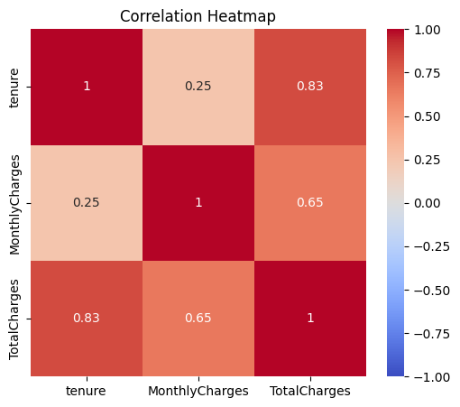

# Modern AI, ML Engineering Coursework

A broad sweep through the modern AI stack, data analysis, classical machine learning, and deep learning, built as part of the AI Academy at Digital Learning Hub Luxembourg (Holberton School ML Engineering curriculum). Chose this track over Data Science specifically because it goes further into the engineering side: building things, not just analyzing them.

---

## About This Repository

This is the widest-ranging repo in the curriculum: it starts with getting raw data (scraping it, cleaning it, visualizing it), moves through classical ML (linear models, tree models, unsupervised learning), and ends in deep learning (CNNs, transfer learning, computer vision architectures). The Telco customer churn notebook at the root ties a lot of it together as a single applied project.

## The Story

The linear_models module was the one that reframed how I think about regularization. Building Ridge, Lasso, SVM, and logistic regression as factory functions, under specific import-style constraints, meant I couldn't just call `LogisticRegression()` and move on. I had to reason about why Ridge shrinks coefficients smoothly while Lasso can zero them out entirely, and when that difference actually matters for a real dataset rather than just being a fact to memorize.

The deep learning side of the repo hit a very different kind of obstacle: a local TensorFlow/Python version incompatibility meant CNN models simply wouldn't train on my machine. Rather than lose time fighting dependency versions, I moved training to Google Colab, which turned into the more practical setup anyway once GPU access was part of it.

## What's Implemented

- Classical ML: linear models (Ridge, Lasso, logistic regression, SVM) built as factory functions
- Tree-based models and an unsupervised learning module
- Deep learning with Keras: CNNs (Sequential and Functional APIs), transfer learning, CV architectures
- Model enhancement techniques (regularization, tuning) under enhancing_dl_models
- Intro to NLP: text exploration and ham/spam classification on the SMS Spam Collection dataset
- Web scraping and data preparation/visualization pipeline
- Capstone: end-to-end Telco customer churn analysis

## What's Next

- Deploy the churn model behind a small API or demo
- Add cross-module unit tests so refactors do not silently break earlier tasks
- Write per-module READMEs that link back to this one

## The Hardest Part

Getting the CNN models to train at all. Locally, a TensorFlow/Python version mismatch meant training would either fail outright or run so slowly it was unusable, and no amount of pip installing the right versions fixed it cleanly. The actual fix was to stop treating that as a problem to solve and just move training to Google Colab instead, which turned a dependency headache into free GPU access. A smaller but real challenge was the linear_models factory-function constraint itself: writing `def ridge_model():` that returns a configured estimator instead of just instantiating one inline forces you to think about the model as a reusable, testable unit rather than a one-off script.

## Tools

Python, scikit-learn, Keras/TensorFlow, pandas, NumPy, NLP tooling

## About the Developer

**Khadija**, Data Analyst based in Luxembourg, currently in the AI Academy at Digital Learning Hub Luxembourg, training as an ML Engineer.
[LinkedIn](https://www.linkedin.com/in/khadija-mustafa-98344527b/) · [Portfolio](https://khadijatheanalyst.github.io) · [GitHub](https://github.com/KhadijaTheAnalyst)
