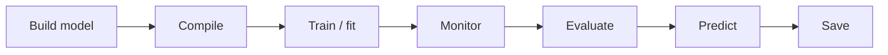

# Keras & TensorFlow: Building, Training, and Evaluating Neural Networks

> [!info] Context
> Part of the ML Engineering track at the [[AI Academy]] (DLH, Holberton curriculum). Follows on from [[Linear Models]] and [[Tree-Based Models]] — this is the first project moving from classical ML into deep learning proper.

## 🎯 Learning Objectives

> [!question] Can I explain these without Google?
> - [ ] What is Keras?
> - [ ] What is TensorFlow?
> - [ ] What is a model?
> - [ ] What is a shallow neural network?
> - [ ] What defines a deep neural network?
> - [ ] What is the Sequential model in Keras?
> - [ ] What is the functional API in Keras?
> - [ ] When should you use a Sequential model vs. a functional model?
> - [ ] What does compiling a model in Keras do?
> - [ ] How do you train a model in Keras?
> - [ ] How do you choose the right loss function and optimizer?
> - [ ] How can you monitor performance during training?
> - [ ] How do you assess the performance of a trained model?
> - [ ] How do you make predictions on new data using a trained model?
> - [ ] How do you save an entire Keras model?
> - [ ] How do you save only the weights of a model?
> - [ ] What is TensorBoard and what is it used for?

---

## 🧠 Core Concepts

### Frameworks: [[TensorFlow]] & [[Keras]]
**TensorFlow** is the underlying numerical computation engine — handles tensors, autodiff, and hardware acceleration (CPU/GPU/TPU).
**Keras** is the high-level API on top of it — readable, declarative building blocks (`Dense`, `compile`, `fit`) instead of manual gradient wiring.

> [!tip] Mental model
> TensorFlow = engine. Keras = dashboard + steering wheel.

### Models & Network Depth
A **model** = architecture (layers) + learned weights + training config (loss, optimizer, metrics).

- **Shallow network** → one hidden layer.
- **Deep network** → multiple stacked hidden layers, each learning progressively more abstract representations (edges → shapes → objects, in the image case).

Links back to [[Linear Models#Logistic Regression|logistic regression]] as a conceptual ancestor — a single-layer network with a sigmoid activation *is* logistic regression.

### Two Ways to Build in Keras

| API | Best for |
|---|---|
| **Sequential** | Simple, linear stack — one input, one output, no branching |
| **Functional** | Multiple inputs/outputs, shared layers, branches, skip connections (e.g. ResNets) |

```python
# Sequential
model = keras.Sequential([
    keras.layers.Dense(64, activation='relu'),
    keras.layers.Dense(10, activation='softmax')
])

# Functional
inputs = keras.Input(shape=(784,))
x = keras.layers.Dense(64, activation='relu')(inputs)
outputs = keras.layers.Dense(10, activation='softmax')(x)
model = keras.Model(inputs, outputs)
```

### The Training Workflow



1. **Compile** — attach loss function + optimizer + metrics.
2. **Train** — `.fit()` runs forward pass → loss → backprop → weight update, across epochs.
3. **Monitor** — validation data + callbacks (`EarlyStopping`, `ModelCheckpoint`, `TensorBoard`).
4. **Evaluate** — `.evaluate()` on held-out test data.
5. **Predict** — `.predict()` on new, unseen data.
6. **Persist** — save full model or just weights.

> [!note] Loss function cheat sheet
> - Regression → MSE / MAE
> - Binary classification → binary cross-entropy
> - Multi-class classification → categorical cross-entropy (one-hot labels) or sparse categorical cross-entropy (integer labels)
>
> Optimizer default: **Adam** (adaptive learning rate, fast convergence). SGD + momentum for more manual control.

### TensorBoard
Built-in TensorFlow visualization suite. Log via callback during `.fit()`, then launch:

```bash
tensorboard --logdir=logs/
```

Used to inspect loss/accuracy curves, weight distributions, and computation graphs — key for debugging training dynamics and comparing runs.

---

## 📊 Dataset — MNIST

70,000 grayscale 28×28 handwritten digit images (0–9): 60,000 train / 10,000 test. Built into Keras, no manual download needed.

```python
from tensorflow import keras

(x_train, y_train), (x_test, y_test) = keras.datasets.mnist.load_data()
```

### Visualizing samples

```python
import matplotlib.pyplot as plt

num_samples = 10
plt.figure(figsize=(10, 2))
for i in range(num_samples):
    plt.subplot(1, num_samples, i + 1)
    plt.imshow(x_train[i], cmap='gray')
    plt.title(f"Label: {y_train[i]}")
    plt.axis('off')
plt.tight_layout()
plt.show()
```

### Inspecting raw pixel values

```python
image = x_train[0]
label = y_train[0]

print("Pixel Values (28x28):")
for row in image:
    print(" ".join(f"{pixel:3}" for pixel in row))

plt.imshow(image, cmap='gray')
plt.title(f"Label: {label}")
plt.colorbar(label="Pixel Intensity")
plt.show()
```

> [!warning] Don't forget to normalize
> Raw pixel values are 0–255. Scale to 0–1 before feeding into the network — training converges faster and more stably on normalized input. This is the same intuition as feature scaling in [[Unsupervised Learning#Standardization|the standardization step]] before PCA/K-Means.

---

## 🔗 Related Notes
- [[Tree-Based Models]]
- [[Unsupervised Learning]]
- [[Linear Models]]
- [[AI Academy]]

## 📌 Open Questions / To Revisit
-
-

